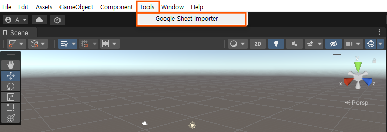
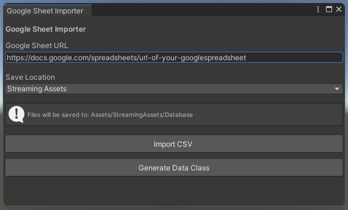
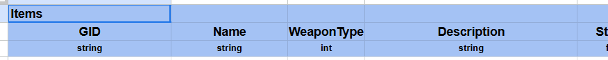

# Unity Google Spreadsheet Importer

This is a sample project created to securely import sheet data from Google Sheets into a Unity project in CSV format and automate the creation of data classes.

## How to use

After opening the project, you can navigate to the import tool's screen via ``Tools > Google Sheet Importer`` in the toolbar.

In the Importer Tool window, enter the URL of the Google Sheet document you wish to import as CSV into the `Google Sheet URL` field to utilize the import automation feature.

* `Save Location`: Specify the location where the downloaded CSV file will be saved.
  * In the current project, you can choose between StreamingAssets or Resources.
* `Import CSV`: Download CSV data from the URL and import it to the specified path.
* `Generate Data Class`: Generates a data class corresponding to each row from the CSV.

## REMARKS

### Form of Spreadsheet

In the current implementation of this project, row 1 represents the `sheet name`, row 2 represents the `field name`, and row 3 represents the `type of each field`.

### Parsable data types

Currently, it only provides parsing functionality for `int`, `float`, `string`, and `UnityEngine.Vector3`.

The current implementation includes only the minimum required functionality, and there are no plans to implement parsing capabilities for other data types.